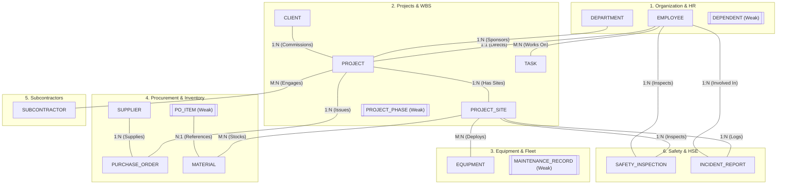
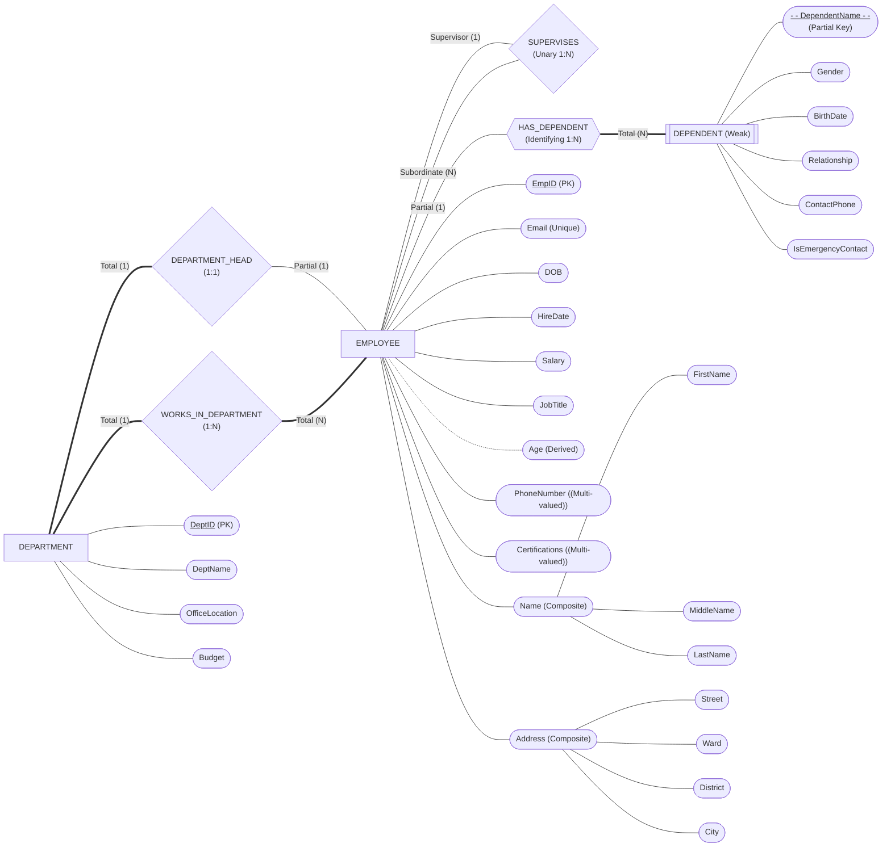
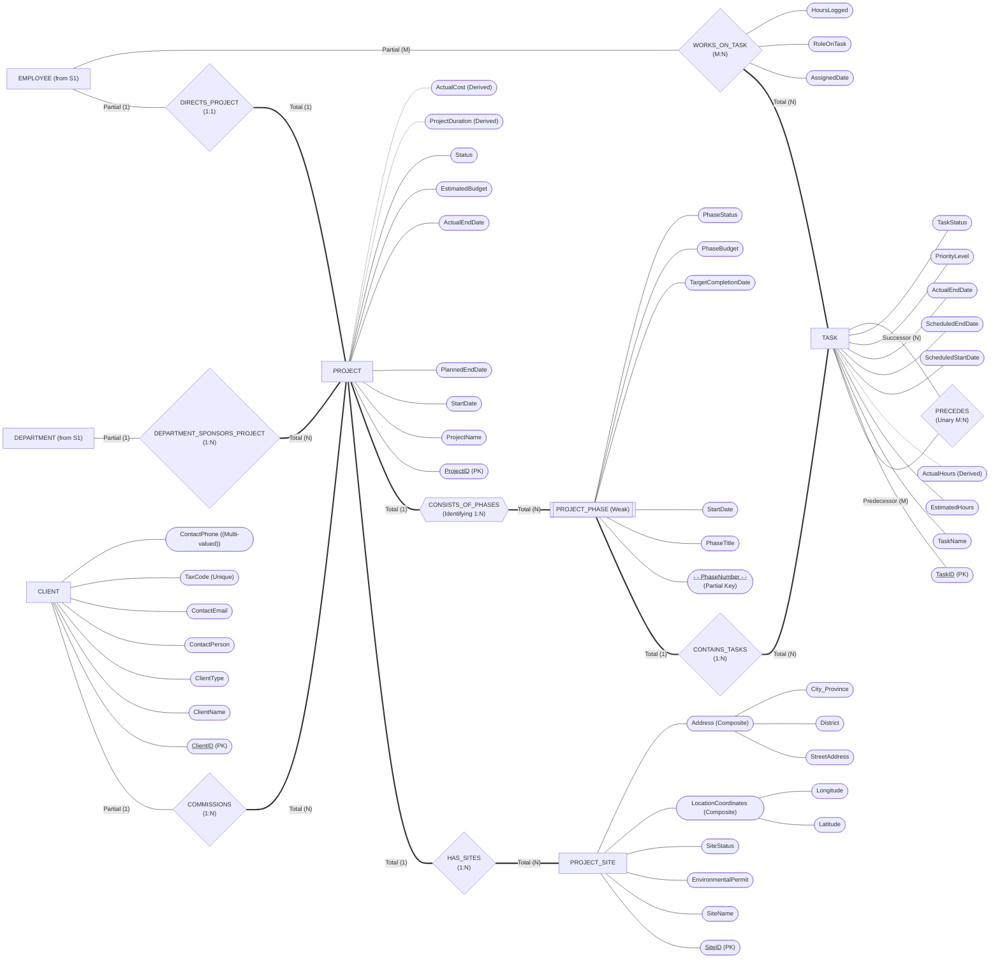
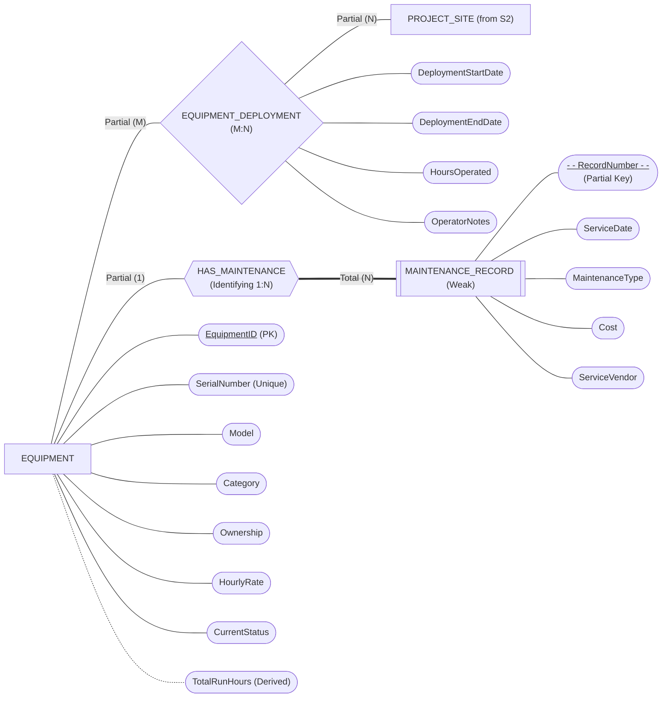
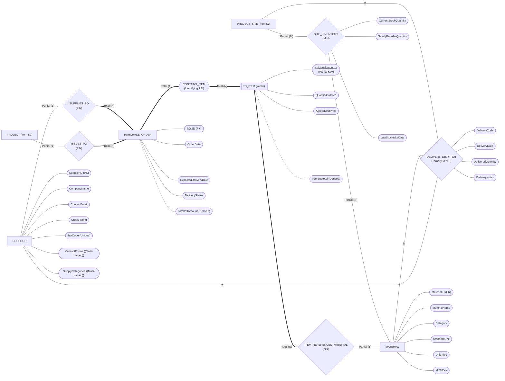
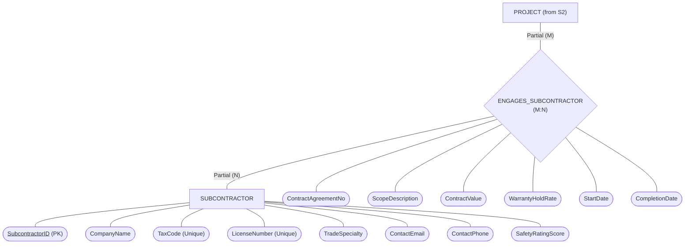
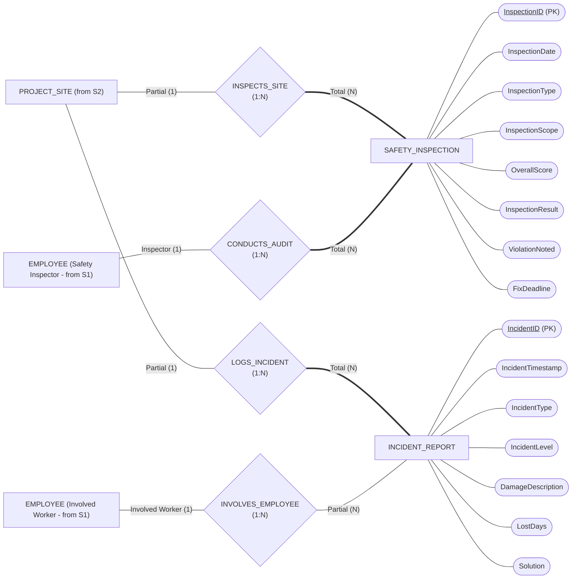
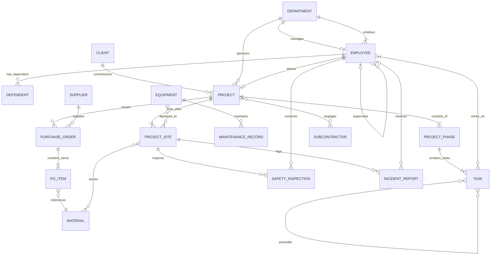

# Database Design Term Project (Phase 2)
## Part 2: Conceptual Design (Entity-Relationship Diagram - ERD)

- **Topic:** Database system for a construction company with multiple projects (A34Build)
- **Course:** Database [E24-Class 5]
- **Team:** 5
- **Members:**
  - Lê Anh Minh (B24DCCE180)
  - Ứng Trọng Trình (B24DCCE271)
  - Nguyễn Đinh Anh Quân (B24DCCE222)
- **Instructor:**Nguyen Dinh Hoa (`hoand@ptit.edu.vn`)
- **Textbook Reference:** *Fundamentals of Database Systems*, 6th Edition (R. Elmasri & S. B. Navathe)

---

## 1. ER Modeling Notational Standards (Elmasri & Navathe)

The conceptual schema follows Chen's classic Entity-Relationship (ER) notation as presented in Chapter 3 of *Fundamentals of Database Systems* (Elmasri & Navathe, 6th Edition):

### 1.1 Graphical Notation Summary
| Schema Element | Visual Shape | Description & Line Style |
| :--- | :--- | :--- |
| **Regular (Strong) Entity** | Single Rectangle | Solid single-line rectangle enclosing the entity name in uppercase |
| **Weak Entity** | Double Rectangle | Concentric double-line rectangle dependent on an identifying entity |
| **Relationship** | Single Diamond | Solid diamond enclosing the relationship name |
| **Identifying Relationship** | Double Diamond | Concentric double-line diamond linking a weak entity to its owner |
| **Simple Attribute** | Single Ellipse (Oval) | Solid oval enclosing attribute name, connected by a line to entity |
| **Primary Key (PK)** | Underlined text inside Oval | Solid underline under the attribute name (`<u>PK</u>`) |
| **Partial Key (Discriminator)** | Dashed underline inside Oval | Dashed underline under attribute name of weak entity |
| **Candidate Key** | Oval with label | Marked with candidate key notation or `(Unique)` |
| **Composite Attribute** | Hierarchical Oval Tree | Parent oval branching into multiple sub-ovals |
| **Multi-valued Attribute** | Double Ellipse | Concentric double-line oval |
| **Derived Attribute** | Dashed Ellipse | Dashed-line oval calculated from other attributes |
| **Total Participation** | Double Line (`==`) | Every entity instance must participate in the relationship |
| **Partial Participation** | Single Line (`--`) | Some entity instances may participate in the relationship |
| **Cardinality Ratio** | Numeric / Letter labels | `1`, `N`, `M`, `P` placed on connecting lines adjacent to entities |

---

## 2. High-Level Master ERD Architecture

The enterprise database of A34Build contains **17 entity types** (13 strong, 4 weak) and **24 relationship types**. To ensure clarity and readability, the complete architecture is organized into **6 cohesive functional subsystems**:

1. **Organization & Human Resources:** `DEPARTMENT`, `EMPLOYEE`, `DEPENDENT`
2. **Project Management & Work Breakdown (WBS):** `CLIENT`, `PROJECT`, `PROJECT_SITE`, `PROJECT_PHASE`, `TASK`
3. **Heavy Equipment & Fleet Maintenance:** `EQUIPMENT`, `MAINTENANCE_RECORD`
4. **Supply Chain, Materials & Site Inventory:** `SUPPLIER`, `MATERIAL`, `PURCHASE_ORDER`, `PO_ITEM`
5. **Trade Subcontractors:** `SUBCONTRACTOR`
6. **Health, Safety & Environment (HSE):** `SAFETY_INSPECTION`, `INCIDENT_REPORT`

> [!NOTE]
> **Architectural Abstraction Note:**
> Sơ đồ kiến trúc mức cao (Mục 2) tập trung phân rã 6 phân hệ (subgraphs) và biểu diễn **15 liên kết cốt lõi liên phân hệ (Inter-subsystem relationships)**. Để giữ cho sơ đồ kiến trúc tổng quan trực quan, rõ ràng và không bị quá tải thị giác, toàn bộ **thuộc tính (attributes)** và **các quan hệ nội bộ trong từng phân hệ (intra-subsystem)** được lược giản tại đây và được đặc tả chi tiết, đầy đủ tại **Mục 3 (Detailed Subsystems)** và **Mục 5 (Master Constraints Matrix)**.

---

## 3. Detailed Subsystem ER Diagrams & Chen Specifications

### 3.1 Subsystem 1: Organization & Human Resources

#### 1. Conceptual Scope
This module handles departmental hierarchies, internal staffing, management oversight, and family benefit / emergency contact records.

#### 2. Detailed Chen Element Mapping
- **`DEPARTMENT` (Strong Entity):**
  - Attributes: `<u>DeptID</u>` (PK), `DeptName`, `OfficeLocation`, `Budget`
- **`EMPLOYEE` (Strong Entity):**
  - Primary Key: `<u>EmpID</u>`
  - Composite Attributes:
    - `Name` $\rightarrow$ (`FirstName`, `MiddleName`, `LastName`)
    - `Address` $\rightarrow$ (`Street`, `Ward`, `District`, `City`)
  - Simple Attributes: `DOB`, `HireDate`, `Salary`, `JobTitle`
  - Candidate Key: `Email` (Unique)
  - Multi-valued Attributes: `PhoneNumber`, `Certifications`
  - Derived Attribute: `Age` (from `CurrentDate - DOB`)
- **`DEPENDENT` (Weak Entity):**
  - Owner Entity: `EMPLOYEE` via identifying relationship `HAS_DEPENDENT`
  - Partial Key: `<u>--DependentName--</u>` (dashed underline)
  - Simple Attributes: `Gender`, `BirthDate`, `Relationship`, `ContactPhone`, `IsEmergencyContact`
- **Relationships:**
  - `DEPARTMENT_HEAD` (1:1): `EMPLOYEE` (Partial) to `DEPARTMENT` (Total)
  - `WORKS_IN_DEPARTMENT` (1:N): `DEPARTMENT` (Total, 1) to `EMPLOYEE` (Total, N)
  - `SUPERVISES` (Unary 1:N): `EMPLOYEE` (Supervisor, 1) to `EMPLOYEE` (Subordinate, N)
  - `HAS_DEPENDENT` (Identifying 1:N): `EMPLOYEE` (Partial, 1) to `DEPENDENT` (Total, N)

#### 3. Visual ER Diagram (Subsystem 1)

> [!TIP]
> **Hướng dẫn & Lưu ý khi vẽ Subsystem 1 trên Draw.io:**
> 1. **Thực thể yếu & Quan hệ định danh:**
>    - `DEPENDENT`: Dùng hình **Double Rectangle** (Hình chữ nhật lồng đôi).
>    - `HAS_DEPENDENT` (trong Mermaid ký hiệu `{{...}}`): Bắt buộc kéo hình **Double Diamond** (Hình thoi lồng đôi) trên Draw.io.
>    - `DependentName`: Dùng hình **Oval**, gạch chân nét đứt `<u>- - DependentName - -</u>` (Partial Key / Discriminator).
> 2. **Thuộc tính suy diễn (Derived Attribute):**
>    - `Age`: Dùng hình **Oval nét đứt (Dashed Ellipse)** và đường nối từ `EMPLOYEE` sang oval cũng là **nét đứt**.
> 3. **Thuộc tính đa trị (Multi-valued Attributes):**
>    - `PhoneNumber` và `Certifications`: Dùng hình **Oval lồng đôi (Double Ellipse)**.
> 4. **Thuộc tính phức hợp (Composite Attributes):**
>    - `Name` và `Address`: Vẽ Oval mẹ nối với `EMPLOYEE`, từ Oval mẹ rẽ nhánh nối ra các Oval con (`FirstName`, `MiddleName`, `LastName` hoặc `Street`, `Ward`, `District`, `City`).
> 5. **Quan hệ đệ quy (Unary Relationship):**
>    - `SUPERVISES`: Vẽ hình thoi đơn, kéo 2 đường nối cùng xuất phát và quay về `EMPLOYEE` với 2 nhãn vai trò: `Supervisor (1)` và `Subordinate (N)`.
> 6. **Ràng buộc tham gia (Participation Constraints):**
>    - Đường từ `DEPARTMENT` đến `DEPARTMENT_HEAD` và `WORKS_IN_DEPARTMENT` là **nét đôi (Double Line / Total Participation)**.
>    - Đường từ `HAS_DEPENDENT` đến `DEPENDENT` là **nét đôi (Total Participation)**. Các đường còn lại là **nét đơn (Partial Participation)**.

---

### 3.2 Subsystem 2: Projects, Work Breakdown Structure (WBS) & Task Execution

#### 1. Conceptual Scope
This core module models contract commissioning, multi-site distributions, chronological project phasing, task dependency networking (CPM), and labor work assignments.

#### 2. Detailed Chen Element Mapping
- **`CLIENT` (Strong Entity):**
  - Attributes: `<u>ClientID</u>` (PK), `ClientName`, `ClientType`, `ContactPerson`, `ContactEmail`, `TaxCode` (Candidate Key), `ContactPhone` (Multi-valued)
- **`PROJECT` (Strong Entity):**
  - Attributes: `<u>ProjectID</u>` (PK), `ProjectName`, `StartDate`, `PlannedEndDate`, `ActualEndDate`, `EstimatedBudget`, `Status`
  - Derived Attributes: `ProjectDuration`, `ActualCost`
- **`PROJECT_SITE` (Strong Entity):**
  - Attributes: `<u>SiteID</u>` (PK), `SiteName`, `EnvironmentalPermit`, `SiteStatus`
  - Composite Attributes:
    - `LocationCoordinates` $\rightarrow$ (`Latitude`, `Longitude`)
    - `Address` $\rightarrow$ (`StreetAddress`, `District`, `City_Province`)
- **`PROJECT_PHASE` (Weak Entity):**
  - Owner Entity: `PROJECT` via identifying relationship `CONSISTS_OF_PHASES`
  - Partial Key: `<u>--PhaseNumber--</u>` (dashed underline)
  - Simple Attributes: `PhaseTitle`, `StartDate`, `TargetCompletionDate`, `PhaseBudget`, `PhaseStatus`
- **`TASK` (Strong Entity):**
  - Attributes: `<u>TaskID</u>` (PK), `TaskName`, `EstimatedHours`, `ScheduledStartDate`, `ScheduledEndDate`, `ActualEndDate`, `PriorityLevel`, `TaskStatus`
  - Derived Attribute: `ActualHours` (sum of logged worker hours)
- **Relationships:**
  - `COMMISSIONS` (1:N): `CLIENT` (Partial, 1) to `PROJECT` (Total, N)
  - `DEPARTMENT_SPONSORS_PROJECT` (1:N): `DEPARTMENT` (Partial, 1) to `PROJECT` (Total, N)
  - `DIRECTS_PROJECT` (1:1): `EMPLOYEE` (Partial, 1) to `PROJECT` (Total, 1)
  - `HAS_SITES` (1:N): `PROJECT` (Total, 1) to `PROJECT_SITE` (Total, N)
  - `CONSISTS_OF_PHASES` (Identifying 1:N): `PROJECT` (Total, 1) to `PROJECT_PHASE` (Total, N)
  - `CONTAINS_TASKS` (1:N): `PROJECT_PHASE` (Total, 1) to `TASK` (Total, N)
  - `PRECEDES` (Unary M:N): `TASK` (Predecessor, M) to `TASK` (Successor, N)
  - `WORKS_ON_TASK` (Binary M:N): `EMPLOYEE` (Partial, M) to `TASK` (Total, N)
    - Relationship Attributes: `AssignedDate`, `RoleOnTask`, `HoursLogged`

#### 3. Visual ER Diagram (Subsystem 2)

> [!TIP]
> **Hướng dẫn & Lưu ý khi vẽ Subsystem 2 trên Draw.io:**
> 1. **Thực thể yếu & Quan hệ định danh:**
>    - `PROJECT_PHASE`: Dùng hình **Double Rectangle** (Hình chữ nhật lồng đôi).
>    - `CONSISTS_OF_PHASES` (trong Mermaid ký hiệu `{{...}}`): Trên Draw.io bắt buộc dùng hình **Double Diamond** (Hình thoi lồng đôi).
>    - `PhaseNumber`: Dùng hình **Oval**, gạch chân nét đứt `<u>- - PhaseNumber - -</u>` (Partial Key / Discriminator).
> 2. **Thuộc tính suy diễn (Derived Attributes):**
>    - `ProjectDuration`, `ActualCost` (của `PROJECT`) và `ActualHours` (của `TASK`): Dùng hình **Oval nét đứt (Dashed Ellipse)** và đường nối từ thực thể sang oval cũng dùng **nét đứt**.
> 3. **Thuộc tính đa trị (Multi-valued Attribute):**
>    - `ContactPhone` của `CLIENT`: Dùng hình **Oval lồng đôi (Double Ellipse)**.
> 4. **Thuộc tính phức hợp (Composite Attributes):**
>    - `LocationCoordinates` và `Address` (của `PROJECT_SITE`): Vẽ Oval mẹ nối với `PROJECT_SITE`, từ Oval mẹ rẽ nhánh nối ra các Oval con (`Latitude`, `Longitude` hoặc `StreetAddress`, `District`, `City_Province`).
> 5. **Thuộc tính của mối quan hệ (Relationship Attributes):**
>    - 3 thuộc tính `AssignedDate`, `RoleOnTask`, `HoursLogged` nối trực tiếp vào hình thoi `WORKS_ON_TASK` (không nối vào Entity).
> 6. **Ràng buộc tham gia (Participation Constraints):**
>    - Dùng **nét đôi (Double Line)** cho các nhánh Total: `PRJ == HAS_SITES == SITE`, `PRJ == CONSISTS_OF_PHASES == PHASE`, `PHASE == CONTAINS_TASKS == TASK`, và nhánh `==` đi vào `PRJ` từ `COMMISSIONS`, `SPONSORS`, `DIRECTS`. Dùng **nét đơn (Single Line)** cho các nhánh Partial.

---

### 3.3 Subsystem 3: Heavy Machinery & Fleet Maintenance

#### 1. Conceptual Scope
This module tracks construction equipment assets, field site deployments with operator assignments, run hour accumulation, and service history.

#### 2. Detailed Chen Element Mapping
- **`EQUIPMENT` (Strong Entity):**
  - Attributes: `<u>EquipmentID</u>` (PK), `Model`, `Category`, `Ownership`, `HourlyRate`, `CurrentStatus`
  - Candidate Key: `SerialNumber` (Unique)
  - Derived Attribute: `TotalRunHours` (cumulative hours across all deployments)
- **`MAINTENANCE_RECORD` (Weak Entity):**
  - Owner Entity: `EQUIPMENT` via identifying relationship `HAS_MAINTENANCE`
  - Partial Key: `<u>--RecordNumber--</u>` (dashed underline)
  - Simple Attributes: `ServiceDate`, `MaintenanceType`, `Cost`, `ServiceVendor`
- **Relationships:**
  - `EQUIPMENT_DEPLOYMENT` (Binary M:N): `EQUIPMENT` (Partial, M) to `PROJECT_SITE` (Partial, N)
    - Relationship Attributes: `DeploymentStartDate`, `DeploymentEndDate`, `HoursOperated`, `OperatorID` (ref `EMPLOYEE`)
  - `HAS_MAINTENANCE` (Identifying 1:N): `EQUIPMENT` (Partial, 1) to `MAINTENANCE_RECORD` (Total, N)

#### 3. Visual ER Diagram (Subsystem 3)

> [!TIP]
> **Hướng dẫn & Lưu ý khi vẽ Subsystem 3 trên Draw.io:**
> 1. **Thực thể yếu & Quan hệ định danh:**
>    - `MAINTENANCE_RECORD`: Dùng hình **Double Rectangle** (Hình chữ nhật lồng đôi).
>    - `HAS_MAINTENANCE` (trong Mermaid ký hiệu `{{...}}`): Bắt buộc dùng hình **Double Diamond** (Hình thoi lồng đôi) trên Draw.io.
>    - `RecordNumber`: Dùng hình **Oval**, gạch chân nét đứt `<u>- - RecordNumber - -</u>` (Partial Key / Discriminator).
> 2. **Thuộc tính suy diễn (Derived Attribute):**
>    - `TotalRunHours`: Dùng hình **Oval nét đứt (Dashed Ellipse)** và đường nối từ `EQUIPMENT` sang oval cũng là **nét đứt**.
> 3. **Thuộc tính quan hệ (Relationship Attributes):**
>    - 4 thuộc tính `DeploymentStartDate`, `DeploymentEndDate`, `HoursOperated`, `OperatorNotes` nối trực tiếp vào hình thoi `EQUIPMENT_DEPLOYMENT`.
> 4. **Ràng buộc tham gia (Participation Constraints):**
>    - Đường từ `HAS_MAINTENANCE` đến `MAINTENANCE_RECORD` là **nét đôi (Double Line / Total Participation)**. Các nhánh còn lại là **nét đơn (Partial Participation)**.

---

### 3.4 Subsystem 4: Supply Chain, Procurement & Site Inventory

#### 1. Conceptual Scope
This module models raw material catalogs, vendor procurement orders, line item details, on-site safety inventory tracking, and three-way physical delivery dispatches.

#### 2. Detailed Chen Element Mapping
- **`SUPPLIER` (Strong Entity):**
  - Attributes: `<u>SupplierID</u>` (PK), `CompanyName`, `ContactEmail`, `CreditRating`
  - Candidate Key: `TaxCode` (Unique)
  - Multi-valued Attributes: `ContactPhone`, `SupplyCategories`
- **`MATERIAL` (Strong Entity):**
  - Attributes: `<u>MaterialID</u>` (PK), `MaterialName`, `Category`, `StandardUnit`, `UnitPrice`, `MinStock`
- **`PURCHASE_ORDER` (Strong Entity):**
  - Attributes: `<u>PO_ID</u>` (PK), `OrderDate`, `ExpectedDeliveryDate`, `DeliveryStatus`
  - Derived Attribute: `TotalPOAmount` (sum of line item subtotals)
- **`PO_ITEM` (Weak Entity):**
  - Owner Entity: `PURCHASE_ORDER` via identifying relationship `CONTAINS_ITEM`
  - Partial Key: `<u>--LineNumber--</u>` (dashed underline)
  - Simple Attributes: `QuantityOrdered`, `AgreedUnitPrice`
  - Derived Attribute: `ItemSubtotal` = (`QuantityOrdered` $\times$ `AgreedUnitPrice`)
- **Relationships:**
  - `ISSUES_PO` (1:N): `PROJECT` (Partial, 1) to `PURCHASE_ORDER` (Total, N)
  - `SUPPLIES_PO` (1:N): `SUPPLIER` (Partial, 1) to `PURCHASE_ORDER` (Total, N)
  - `CONTAINS_ITEM` (Identifying 1:N): `PURCHASE_ORDER` (Total, 1) to `PO_ITEM` (Total, N)
  - `ITEM_REFERENCES_MATERIAL` (N:1): `PO_ITEM` (Total, N) to `MATERIAL` (Partial, 1)
  - `SITE_INVENTORY` (Binary M:N): `PROJECT_SITE` (Partial, M) to `MATERIAL` (Partial, N)
    - Relationship Attributes: `CurrentStockQuantity`, `SafetyReorderQuantity`, `LastStocktakeDate`
  - `DELIVERY_DISPATCH` (Ternary M:N:P): `SUPPLIER` (M) $\times$ `MATERIAL` (N) $\times$ `PROJECT_SITE` (P)
    - Relationship Attributes: `DeliveryCode`, `DeliveryDate`, `DeliveredQuantity`, `DeliveryNotes` *(Note: In strict Chen conceptual ERD, foreign keys such as `ReceiverEmployeeID` or `PO_ID` are relational concepts and are not modeled as attributes; they are resolved during Phase 2 Logical Schema conversion).*

#### 3. Visual ER Diagram (Subsystem 4)

> [!TIP]
> **Hướng dẫn & Lưu ý khi vẽ Subsystem 4 trên Draw.io:**
> 1. **Thực thể yếu & Quan hệ định danh:**
>    - `PO_ITEM`: Dùng hình **Double Rectangle** (Hình chữ nhật lồng đôi).
>    - `CONTAINS_ITEM` (trong Mermaid ký hiệu `{{...}}`): Bắt buộc dùng hình **Double Diamond** (Hình thoi lồng đôi) trên Draw.io.
>    - `LineNumber`: Dùng hình **Oval**, gạch chân nét đứt `<u>- - LineNumber - -</u>` (Partial Key / Discriminator).
> 2. **Quan hệ 3 ngôi (Ternary Relationship - DELIVERY_DISPATCH):**
>    - Kéo 1 hình thoi **DELIVERY_DISPATCH**, vẽ 3 đường nối xuất phát từ 3 thực thể: `SUPPLIER`, `MATERIAL` và `PROJECT_SITE`. Ghi tỉ lệ `M`, `N`, `P` lên từng nhánh.
>    - Nối 4 Oval thuộc tính (`DeliveryCode`, `DeliveryDate`, `DeliveredQuantity`, `DeliveryNotes`) trực tiếp vào hình thoi `DELIVERY_DISPATCH`.
> 3. **Thuộc tính suy diễn (Derived Attributes):**
>    - `TotalPOAmount` (của `PURCHASE_ORDER`) và `ItemSubtotal` (của `PO_ITEM`): Dùng hình **Oval nét đứt (Dashed Ellipse)** và đường nối là **nét đứt**.
> 4. **Thuộc tính đa trị (Multi-valued Attributes):**
>    - `ContactPhone` và `SupplyCategories` của `SUPPLIER`: Dùng hình **Oval lồng đôi (Double Ellipse)**.
> 5. **Ràng buộc tham gia (Participation Constraints):**
>    - Nhánh `==` (Total Participation): `PURCHASE_ORDER` vào `CONTAINS_ITEM`, `PO_ITEM` vào `CONTAINS_ITEM`, `PO_ITEM` vào `ITEM_REFERENCES_MATERIAL`, và `PURCHASE_ORDER` đi từ `ISSUES_PO`, `SUPPLIES_PO`.

---

### 3.5 Subsystem 5: Trade Subcontractors

#### 1. Conceptual Scope
This module handles specialized trade contractors, trade certifications, and contract engagement terms.

#### 2. Detailed Chen Element Mapping
- **`SUBCONTRACTOR` (Strong Entity):**
  - Attributes: `<u>SubcontractorID</u>` (PK), `CompanyName`, `TradeSpecialty`, `ContactEmail`, `ContactPhone`, `SafetyRatingScore`
  - Candidate Keys: `TaxCode` (Unique), `LicenseNumber` (Unique)
- **Relationship:**
  - `ENGAGES_SUBCONTRACTOR` (Binary M:N): `PROJECT` (Partial, M) to `SUBCONTRACTOR` (Partial, N)
    - Relationship Attributes: `ContractAgreementNo`, `ScopeDescription`, `ContractValue`, `WarrantyHoldRate`, `StartDate`, `CompletionDate`

#### 3. Visual ER Diagram (Subsystem 5)

> [!TIP]
> **Hướng dẫn & Lưu ý khi vẽ Subsystem 5 trên Draw.io:**
> 1. **Thuộc tính thực thể:**
>    - `SubcontractorID`: Gạch chân nét liền `<u>SubcontractorID</u>` trong hình **Oval** (Primary Key).
>    - `TaxCode` và `LicenseNumber`: Ghi nhãn `(Unique)` hoặc `(Candidate Key)` trong hình **Oval**.
> 2. **Thuộc tính của mối quan hệ M:N:**
>    - 6 thuộc tính hợp đồng (`ContractAgreementNo`, `ScopeDescription`, `ContractValue`, `WarrantyHoldRate`, `StartDate`, `CompletionDate`) phải nối trực tiếp vào hình thoi `ENGAGES_SUBCONTRACTOR`.
> 3. **Ràng buộc tham gia (Participation Constraints):**
>    - Cả 2 phía `PROJECT` và `SUBCONTRACTOR` đều dùng **nét đơn (Partial Participation)** vì một dự án có thể chưa thuê thầu phụ, và một nhà thầu phụ có thể chưa được giao dự án nào.

---

### 3.6 Subsystem 6: Site Safety, Audits & Incident Management

#### 1. Conceptual Scope
This module models site safety compliance audits conducted by certified inspectors, workplace incident logging, affected worker tracing, and emergency contact linkage.

#### 2. Detailed Chen Element Mapping
- **`SAFETY_INSPECTION` (Strong Entity):**
  - Attributes: `<u>InspectionID</u>` (PK), `InspectionDate`, `InspectionType`, `InspectionScope`, `OverallScore`, `InspectionResult`, `ViolationNoted`, `FixDeadline`
- **`INCIDENT_REPORT` (Strong Entity):**
  - Attributes: `<u>IncidentID</u>` (PK), `IncidentTimestamp`, `IncidentType`, `IncidentLevel`, `DamageDescription`, `LostDays`, `Solution`
- **Relationships:**
  - `CONDUCTS_INSPECTION` (Dual 1:N binary structure):
    - `PROJECT_SITE` (Partial, 1) to `SAFETY_INSPECTION` (Total, N) via `INSPECTS_SITE`
    - `EMPLOYEE` (Safety Inspector, Partial, 1) to `SAFETY_INSPECTION` (Total, N) via `CONDUCTS_AUDIT`
  - `LOGS_INCIDENT` (Binary 1:N): `PROJECT_SITE` (Partial, 1) to `INCIDENT_REPORT` (Total, N)
  - `INVOLVES_EMPLOYEE` (Binary 1:N): `EMPLOYEE` (Partial, 1) to `INCIDENT_REPORT` (Partial, N)

#### 3. Visual ER Diagram (Subsystem 6)

> [!TIP]
> **Hướng dẫn & Lưu ý khi vẽ Subsystem 6 trên Draw.io:**
> 1. **Mô hình hóa thanh tra an toàn (Dual 1:N):**
>    - Vẽ 2 hình thoi nhị phân riêng biệt: `INSPECTS_SITE` (giữa `PROJECT_SITE` và `SAFETY_INSPECTION`) và `CONDUCTS_AUDIT` (giữa `EMPLOYEE` và `SAFETY_INSPECTION`).
> 2. **Ràng buộc tham gia (Participation Constraints):**
>    - `SAFETY_INSPECTION` bắt buộc phải có công trường và thanh tra viên $\to$ 2 nhánh đi vào `SAFETY_INSPECTION` là **nét đôi (Double Line / Total Participation)**.
>    - `PROJECT_SITE` và `EMPLOYEE` đều là **nét đơn (Partial Participation)** (công trường chưa chắc đã thanh tra, công nhân bình thường không làm thanh tra).
>    - `INCIDENT_REPORT` bắt buộc xảy ra tại một công trường $\to$ nhánh từ `LOGS_INCIDENT` vào `INCIDENT_REPORT` là **nét đôi (Total)**.
>    - Nhánh `INVOLVES_EMPLOYEE` là **nét đơn ở cả 2 đầu** (vì có những sự cố chỉ thiệt hại máy móc/tài sản mà không có người bị thương).

---

## 4. Master ERD Representation (Complete Entity-Relationship Network)

The following diagram connects all 17 entity types across relationships into a unified conceptual schema (Crow's Foot notation):

> [!IMPORTANT]
> **Ternary Relationship Representation Note (`DELIVERY_DISPATCH`):**
> Cú pháp tiêu chuẩn của Mermaid `erDiagram` chỉ hỗ trợ quan hệ nhị phân (Binary - giữa 2 thực thể). Do đó, mối quan hệ bậc 3 (Ternary M:N:P) `DELIVERY_DISPATCH` giữa `SUPPLIER` $\times$ `MATERIAL` $\times$ `PROJECT_SITE` không thể vẽ trực tiếp trong block `erDiagram` trên mà không làm biến dạng mô hình. Mối quan hệ này được đặc tả chi tiết tại **Phân hệ 4 (Mục 3.4)**, **Bảng ma trận quan hệ (Mục 5, STT 20)** và được vẽ đầy đủ bằng hình thoi 3 nhánh theo chuẩn Chen trên bản vẽ nộp chính thức (Draw.io / Vector PDF).

---

## 5. Master Structural Constraints & Cardinality Matrix

This table summarizes all constraints, cardinalities, participations, and relationship attributes across the entire schema:

| No. | Relationship Name | Participating Entities | Ratio | Participation Constraints | Relationship Attributes |
| :---: | :--- | :--- | :---: | :--- | :--- |
| **1** | `DEPARTMENT_HEAD` | `EMPLOYEE` : `DEPARTMENT` | 1:1 | `DEPT`: Total, `EMP`: Partial | *None* |
| **2** | `WORKS_IN_DEPARTMENT` | `DEPARTMENT` : `EMPLOYEE` | 1:N | `EMP`: Total, `DEPT`: Total | *None* |
| **3** | `SUPERVISES` | `EMPLOYEE` : `EMPLOYEE` | Unary 1:N | Both roles: Partial | *None* |
| **4** | `HAS_DEPENDENT` | `EMPLOYEE` : `DEPENDENT` | Ident. 1:N | `DEP`: Total, `EMP`: Partial | *None* |
| **5** | `COMMISSIONS` | `CLIENT` : `PROJECT` | 1:N | `PRJ`: Total, `CLIENT`: Partial | *None* |
| **6** | `DEPARTMENT_SPONSORS_PROJECT` | `DEPARTMENT` : `PROJECT` | 1:N | `PRJ`: Total, `DEPT`: Partial | *None* |
| **7** | `DIRECTS_PROJECT` | `EMPLOYEE` : `PROJECT` | 1:1 | `PRJ`: Total, `EMP`: Partial | *None* |
| **8** | `HAS_SITES` | `PROJECT` : `PROJECT_SITE` | 1:N | `PRJ`: Total, `SITE`: Total | *None* |
| **9** | `CONSISTS_OF_PHASES` | `PROJECT` : `PROJECT_PHASE` | Ident. 1:N | `PHASE`: Total, `PRJ`: Total | *None* |
| **10** | `CONTAINS_TASKS` | `PROJECT_PHASE` : `TASK` | 1:N | `PHASE`: Total, `TASK`: Total | *None* |
| **11** | `PRECEDES` | `TASK` : `TASK` | Unary M:N | Both roles: Partial | *None* |
| **12** | `WORKS_ON_TASK` | `EMPLOYEE` : `TASK` | M:N | `TASK`: Total, `EMP`: Partial | `AssignedDate`, `RoleOnTask`, `HoursLogged` |
| **13** | `EQUIPMENT_DEPLOYMENT` | `EQUIPMENT` : `PROJECT_SITE` | M:N | Both sides: Partial | `DeploymentStartDate`, `DeploymentEndDate`, `HoursOperated`, `OperatorID` |
| **14** | `HAS_MAINTENANCE` | `EQUIPMENT` : `MAINTENANCE_RECORD` | Ident. 1:N | `RECORD`: Total, `EQUIP`: Partial | *None* |
| **15** | `ISSUES_PO` | `PROJECT` : `PURCHASE_ORDER` | 1:N | `PO`: Total, `PRJ`: Partial | *None* |
| **16** | `SUPPLIES_PO` | `SUPPLIER` : `PURCHASE_ORDER` | 1:N | `PO`: Total, `SUPP`: Partial | *None* |
| **17** | `CONTAINS_ITEM` | `PURCHASE_ORDER` : `PO_ITEM` | Ident. 1:N | `ITEM`: Total, `PO`: Total | *None* |
| **18** | `ITEM_REFERENCES_MATERIAL` | `PO_ITEM` : `MATERIAL` | N:1 | `ITEM`: Total, `MAT`: Partial | *None* |
| **19** | `SITE_INVENTORY` | `PROJECT_SITE` : `MATERIAL` | M:N | Both sides: Partial | `CurrentStockQuantity`, `SafetyReorderQuantity`, `LastStocktakeDate` |
| **20** | `DELIVERY_DISPATCH` | `SUPPLIER` $\times$ `MATERIAL` $\times$ `PROJECT_SITE` | Ternary M:N:P | All 3 sides: Partial | `DeliveryCode`, `DeliveryDate`, `DeliveredQuantity`, `DeliveryNotes` |
| **21** | `ENGAGES_SUBCONTRACTOR` | `PROJECT` : `SUBCONTRACTOR` | M:N | Both sides: Partial | `ContractAgreementNo`, `ScopeDescription`, `ContractValue`, `WarrantyHoldRate`, `StartDate`, `CompletionDate` |
| **22** | `CONDUCTS_INSPECTION` | `PROJECT_SITE` : `SAFETY_INSPECTION` : `EMPLOYEE` | Dual 1:N | `INSP`: Total on both branches | *None* |
| **23** | `LOGS_INCIDENT` | `PROJECT_SITE` : `INCIDENT_REPORT` | 1:N | `INC`: Total, `SITE`: Partial | *None* |
| **24** | `INVOLVES_EMPLOYEE` | `EMPLOYEE` : `INCIDENT_REPORT` | 1:N | Both sides: Partial | *None* |

---

## 6. Business Constraints Not Expressible in ER Notation

Per the instructions of Dr. Hoang Dang Hai, business constraints and integrity rules that cannot be captured graphically through Chen's ER notations are explicitly documented here and will be enforced via SQL triggers, stored procedures, or check constraints in Phase 3:

1. **Phase Budget Accumulation Constraint:**
   - $\sum (\text{PhaseBudget}) \le \text{EstimatedBudget}$ for any given project. ER notation cannot express aggregate inequality constraints across child records.
2. **Machinery Schedule Non-Overlapping Constraint:**
   - A piece of equipment cannot have overlapping `[DeploymentStartDate, DeploymentEndDate]` intervals across two different `PROJECT_SITE`s. ER notation cannot evaluate interval disjointness across M:N relationship instances.
3. **Equipment Operator Certification Rule:**
   - An employee assigned as `OperatorID` on an `EQUIPMENT_DEPLOYMENT` must hold an active certification corresponding to the equipment's `Category` in their multi-valued `Certifications` attribute.
4. **Maximum Daily Working Hour Limit:**
   - A worker cannot log more than 12 hours total ($\sum \text{HoursLogged} \le 12$) across all tasks on any single calendar date.
5. **Acyclic Dependency Constraint (DAG):**
   - The recursive `PRECEDES` relationship on `TASK` must form a Directed Acyclic Graph (DAG) without circular dependency loops ($T_A \to T_B \to \dots \to T_A$).
6. **Material Stock Overdraft Prevention:**
   - Daily material consumption deducted from `SITE_INVENTORY` cannot exceed `CurrentStockQuantity`.
7. **Single Active Project Limit for Site Directors:**
   - Although `DIRECTS_PROJECT` is modeled as 1:1, an employee can direct at most one project whose `Status` is `Active` or `In-Progress` simultaneously.
8. **Emergency Notification Trigger:**
   - When an `INCIDENT_REPORT` is created with `INVOLVES_EMPLOYEE` populated, the system automatically fires a lookup to find the employee's dependent where `IsEmergencyContact = true` to dispatch an urgent notification.

---

## 7. Guidelines for Exporting and Drawing in Draw.io (diagrams.net)

To produce the high-resolution vector diagrams for your final Word/PDF report:

1. Open [draw.io](https://app.diagrams.net/).
2. In the left panel, click **More Shapes** $\rightarrow$ Check **Entity Relation**.
3. Use the shapes strictly adhering to Chen's notation:
   - **Entity:** `Rectangle`
   - **Weak Entity:** `Double Rectangle`
   - **Relationship:** `Rhombus / Diamond`
   - **Identifying Relationship:** `Double Rhombus / Diamond`
   - **Attribute:** `Ellipse`
   - **Primary Key:** `Underline text`
   - **Partial Key:** `Dashed underline text`
   - **Multi-valued Attribute:** `Double Ellipse`
   - **Derived Attribute:** `Dashed Ellipse`
   - **Participation:** Use double lines for Total participation (`Format panel` $\rightarrow$ `Line` $\rightarrow$ `Double`).
4. Recommended export format: **PDF** hoặc **SVG** (vector format ensures zero blurriness when printed or converted to Word).

